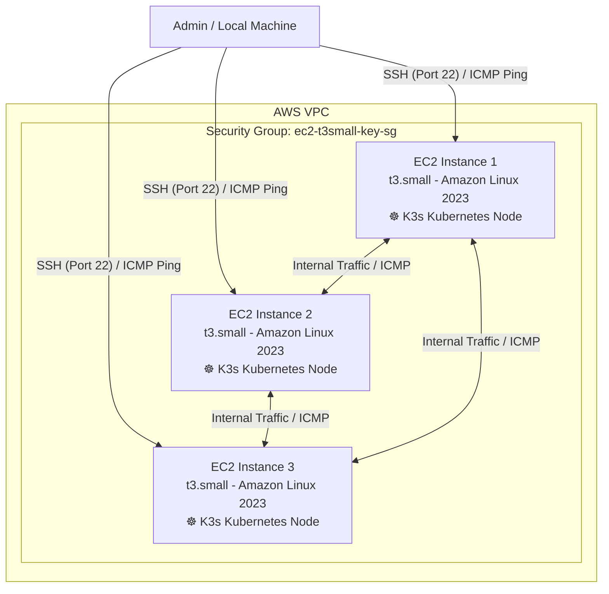

# Infrastructure as Code (IaC) Learning: AWS EC2, Ansible & K3s Kubernetes

This project demonstrates an end-to-end Infrastructure as Code (IaC), configuration management, and Kubernetes deployment workflow. It uses **Terraform** to provision AWS infrastructure (EC2 instances, security groups, and SSH keys), **Ansible** for automated node configuration and package management, and deploys **K3s (Lightweight Kubernetes)** across the cluster.

---

## 🏗️ Architecture Overview



---

## 📁 Repository Structure

```text
.
├── Ansible/
│   ├── ansible.cfg       # Ansible configuration (user, SSH key, inventory defaults)
│   ├── inventory.ini     # Inventory file defining the webservers group
│   └── playbook.yml      # Ansible playbook for system updates & K3s Kubernetes deployment
├── .gitignore            # Git ignore file for secrets and state
├── main.tf               # Terraform EC2 instances, key pair, and security group
├── outputs.tf            # Terraform output definitions (IDs, IPs, SSH commands)
├── providers.tf          # AWS and Local/TLS provider definitions
├── variables.tf          # Configurable variables (region, instance type, CIDR)
├── terraform.tfvars      # Local variable values (credentials, region)
└── README.md             # Project documentation
```

---

## ⚙️ What Was Built

### 1. Terraform Infrastructure
* **Automated SSH Key Management**:
  * An RSA 4096-bit private key is generated via `tls_private_key`.
  * The public key is registered in AWS as `aws_key_pair`.
  * The private key is saved locally to `ec2-key.pem` with secure permissions (`0600`) and ignored by git for security.
* **Security Group Configuration (`ec2_sg`)**:
  * **SSH (Port 22)**: Ingress allowed from the configured CIDR block.
  * **ICMP**: Ingress enabled across all types/codes (`0.0.0.0/0`) to allow pinging from anywhere.
  * **Intra-Cluster Intercommunication (`self = true`)**: Full traffic and ICMP enabled between instances in the same security group over their private IPs.
  * **Egress**: Unrestricted outbound access (`0.0.0.0/0`).
* **Compute**:
  * Deploys 3 `t3.small` EC2 instances running **Amazon Linux 2023** queried dynamically via `aws_ami`.

### 2. Ansible Integration
* **`inventory.ini`**:
  * Groups the 3 instance public IP addresses under `[webservers]`.
* **`ansible.cfg`**:
  * Automatically sets the default inventory to `./inventory.ini`.
  * Configures `remote_user = ec2-user`.
  * Specifies `private_key_file` pointing to the generated `ec2-key.pem`.
  * Disables strict host key checking (`host_key_checking = False`) for seamless automation.

### 3. K3s Lightweight Kubernetes
* **Automated Installation**:
  * Deploys single-node K3s instances on all target nodes via the official script (`https://get.k3s.io`).
  * Uses idempotent execution (`creates: /usr/local/bin/k3s`) to skip re-downloading if already present.
* **Systemd Service Management**:
  * Automatically enables and starts `k3s.service` using Ansible's `systemd` module.
* **Kubeconfig & Access**:
  * Waits for cluster initialization and kubeconfig creation (`/etc/rancher/k3s/k3s.yaml`).
  * Sets safe readable permissions (`0644`) on the kubeconfig.
* **Verification**:
  * Executes `k3s --version` and prints the output during playbook execution.

---

## 🚀 Quick Start Guide

### Prerequisites & Installation

#### 1. Install Terraform

<details>
<summary><b>Ubuntu / Debian</b></summary>

```bash
sudo apt-get update && sudo apt-get install -y gnupg software-properties-common curl
curl -fsSL https://apt.releases.hashicorp.com/gpg | sudo gpg --dearmor -o /usr/share/keyrings/hashicorp-archive-keyring.gpg
echo "deb [signed-by=/usr/share/keyrings/hashicorp-archive-keyring.gpg] https://apt.releases.hashicorp.com $(lsb_release -cs) main" | sudo tee /etc/apt/sources.list.d/hashicorp.list
sudo apt-get update && sudo apt-get install -y terraform
```
</details>

<details>
<summary><b>RHEL / CentOS / Amazon Linux / Fedora</b></summary>

```bash
sudo yum install -y yum-utils
sudo yum-config-manager --add-repo https://rpm.releases.hashicorp.com/RHEL/hashicorp.repo
sudo yum -y install terraform
```
</details>

<details>
<summary><b>macOS (Homebrew)</b></summary>

```bash
brew tap hashicorp/tap
brew install hashicorp/tap/terraform
```
</details>

<details>
<summary><b>Windows</b></summary>

```powershell
winget install HashiCorp.Terraform
# or using Chocolatey
choco install terraform
```
</details>

*Verify installation:*
```bash
terraform version
```

---

#### 2. Install Ansible

<details>
<summary><b>Using Python pipx / pip (Recommended for all platforms)</b></summary>

```bash
# Recommended with pipx (isolated environment)
sudo apt install -y pipx || sudo yum install -y pipx
pipx install --include-deps ansible
pipx ensurepath

# Or via standard pip
python3 -m pip install --user ansible
```
</details>

<details>
<summary><b>Ubuntu / Debian (via PPA)</b></summary>

```bash
sudo apt update
sudo apt install -y software-properties-common
sudo add-apt-repository --yes --update ppa:ansible/ansible
sudo apt install -y ansible
```
</details>

<details>
<summary><b>macOS (Homebrew)</b></summary>

```bash
brew install ansible
```
</details>

*Verify installation:*
```bash
ansible --version
```

---

### 1. Provision Infrastructure with Terraform

```bash
# Initialize Terraform and download providers
terraform init

# Validate the configuration
terraform validate

# Review the execution plan
terraform plan

# Deploy the infrastructure
terraform apply
```

After deployment completes, Terraform outputs the public IPs, private IPs, and ready-to-run SSH commands:

```bash
terraform output
```

---

### 2. Verify Connectivity

#### Direct SSH
Connect to any instance using the generated key:
```bash
ssh -i ./ec2-key.pem ec2-user@<INSTANCE_PUBLIC_IP>
```

#### ICMP Ping Between Instances
Log into one instance and ping another via its private IP:
```bash
ping <ANOTHER_INSTANCE_PRIVATE_IP>
```

---

### 3. Run Ansible

Move into the `Ansible/` directory to run commands using the configured `ansible.cfg` and `inventory.ini`:

```bash
cd Ansible
```

#### Connectivity & Verification
Test ping across all managed instances:
```bash
# Test connectivity to all webservers
ansible webservers -m ping
```

Expected output:
```text
13.63.20.236 | SUCCESS => {
    "ansible_facts": {
        "discovered_interpreter_python": "/usr/bin/python3.9"
    },
    "changed": false,
    "ping": "pong"
}
...
```

---

#### 💡 Essential Ansible Ad-Hoc CLI Commands

Ad-hoc commands allow quick one-liner actions across all target nodes without creating a dedicated playbook.

> [!TIP]
> Use `-b` (or `--become`) to execute commands with `sudo` privileges when making system-level changes (e.g. package installation, service controls).

##### 📦 Package Management (`dnf`)
```bash
# Refresh / update package repository cache
ansible webservers -b -m dnf -a "update_cache=yes"

# Upgrade all installed packages to their latest versions
ansible webservers -b -m dnf -a "name=* state=latest"

# Install a package (e.g., git or nginx)
ansible webservers -b -m dnf -a "name=git state=present"

# Remove an unwanted package
ansible webservers -b -m dnf -a "name=git state=absent"
```

##### 🖥️ System Health & Command Execution
```bash
# Check system uptime across instances (default module is command)
ansible webservers -a "uptime"

# Check available disk space
ansible webservers -a "df -h"

# Check memory usage
ansible webservers -a "free -m"

# Execute commands requiring pipes or shell redirection using the shell module
ansible webservers -m shell -a "uname -r && cat /etc/os-release | grep PRETTY_NAME"
```

##### ⚙️ Service Management (`service` / `systemd`)
```bash
# Start and enable a service on boot
ansible webservers -b -m service -a "name=nginx state=started enabled=yes"

# Restart a service
ansible webservers -b -m service -a "name=nginx state=restarted"

# Stop a service
ansible webservers -b -m service -a "name=nginx state=stopped"
```

##### 🔍 System Facts & Hardware Discovery (`setup`)
```bash
# Gather all system facts and environment variables
ansible webservers -m setup

# Filter for distribution information
ansible webservers -m setup -a "filter=ansible_distribution*"

# Filter for network IP information
ansible webservers -m setup -a "filter=ansible_default_ipv4"
```

##### 📁 Files & Directories (`file`, `copy`)
```bash
# Create a new directory
ansible webservers -m file -a "path=/home/ec2-user/app state=directory mode='0755'"

# Copy a local file to all remote servers
ansible webservers -m copy -a "src=./sample.txt dest=/home/ec2-user/sample.txt mode='0644'"

# Delete a file or directory
ansible webservers -m file -a "path=/home/ec2-user/sample.txt state=absent"
```

---

#### 🚀 Deploying K3s Kubernetes via Playbook

The [`Ansible/playbook.yml`](file:///home/anwartamasna/terraform_ec2_with_ssh_key/Ansible/playbook.yml) automates:
1. **System Upgrade**: Updates all OS packages via `dnf`.
2. **K3s Installation**: Fetches and executes the official K3s install script (`creates: /usr/local/bin/k3s`).
3. **Service Management**: Ensures `k3s.service` is enabled on boot and running via `systemd`.
4. **Cluster Readiness**: Waits for `/etc/rancher/k3s/k3s.yaml` to be created.
5. **Permissions**: Sets `0644` readable permissions on the kubeconfig.
6. **Verification**: Executes `k3s --version` and prints the output.

```bash
# 1. Validate playbook syntax
ansible-playbook --syntax-check playbook.yml

# 2. Deploy K3s across the entire webservers cluster
ansible-playbook playbook.yml
```

##### ☸️ Verifying K3s & Kubernetes Cluster with Ansible Ad-Hoc Commands

After deployment completes, verify cluster health and running workloads across all nodes directly:

```bash
# Check K3s service status
ansible webservers -a "systemctl status k3s"

# Check Kubernetes node status on each server
ansible webservers -a "k3s kubectl get nodes"

# Inspect running pods across all namespaces
ansible webservers -a "k3s kubectl get pods -A"

# Verify kubeconfig file exists and permissions are 0644
ansible webservers -a "ls -l /etc/rancher/k3s/k3s.yaml"
```

---

## 🧹 Cleanup / Teardown

To destroy all created AWS resources and prevent unwanted cloud charges:

```bash
terraform destroy
```