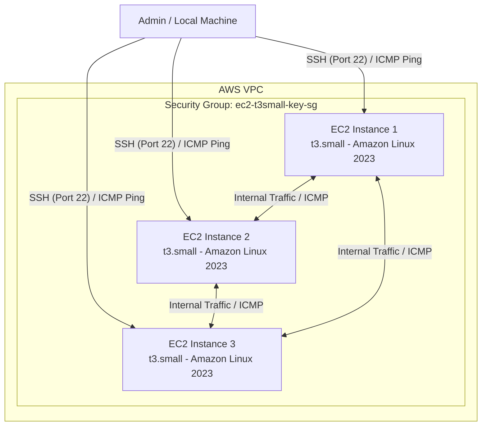

# Infrastructure as Code (IaC) Learning: AWS EC2 & Ansible Automation

This project demonstrates an end-to-end Infrastructure as Code (IaC) and configuration management workflow. It uses **Terraform** to provision AWS infrastructure (EC2 instances, security groups, and SSH keys) and configures **Ansible** to manage the deployed nodes.

---

## 🏗️ Architecture Overview



---

## 📁 Repository Structure

```text
.
├── Ansible/
│   ├── ansible.cfg       # Ansible configuration (user, SSH key, inventory defaults)
│   ├── inventory.ini     # Inventory file defining the webservers group
│   └── playbook.yml      # Ansible playbook for server configuration
├── .gitignore            # Git ignore file for secrets and state
├── main.tf               # Terraform EC2 instances, key pair, and security group
├── outputs.tf            # Terraform output definitions (IDs, IPs, SSH commands)
├── providers.tf          # AWS and Local/TLS provider definitions
├── variables.tf          # Configurable variables (region, instance type, CIDR)
├── terraform.tfvars      # Local variable values (credentials, region)
└── README.md             # Project documentation
```

---

## ⚙️ What Was Built

### 1. Terraform Infrastructure
* **Automated SSH Key Management**:
  * An RSA 4096-bit private key is generated via `tls_private_key`.
  * The public key is registered in AWS as `aws_key_pair`.
  * The private key is saved locally to `ec2-key.pem` with secure permissions (`0600`) and ignored by git for security.
* **Security Group Configuration (`ec2_sg`)**:
  * **SSH (Port 22)**: Ingress allowed from the configured CIDR block.
  * **ICMP**: Ingress enabled across all types/codes (`0.0.0.0/0`) to allow pinging from anywhere.
  * **Intra-Cluster Intercommunication (`self = true`)**: Full traffic and ICMP enabled between instances in the same security group over their private IPs.
  * **Egress**: Unrestricted outbound access (`0.0.0.0/0`).
* **Compute**:
  * Deploys 3 `t3.small` EC2 instances running **Amazon Linux 2023** queried dynamically via `aws_ami`.

### 2. Ansible Integration
* **`inventory.ini`**:
  * Groups the 3 instance public IP addresses under `[webservers]`.
* **`ansible.cfg`**:
  * Automatically sets the default inventory to `./inventory.ini`.
  * Configures `remote_user = ec2-user`.
  * Specifies `private_key_file` pointing to the generated `ec2-key.pem`.
  * Disables strict host key checking (`host_key_checking = False`) for seamless automation.

---

## 🚀 Quick Start Guide

### Prerequisites & Installation

#### 1. Install Terraform

<details>
<summary><b>Ubuntu / Debian</b></summary>

```bash
sudo apt-get update && sudo apt-get install -y gnupg software-properties-common curl
curl -fsSL https://apt.releases.hashicorp.com/gpg | sudo gpg --dearmor -o /usr/share/keyrings/hashicorp-archive-keyring.gpg
echo "deb [signed-by=/usr/share/keyrings/hashicorp-archive-keyring.gpg] https://apt.releases.hashicorp.com $(lsb_release -cs) main" | sudo tee /etc/apt/sources.list.d/hashicorp.list
sudo apt-get update && sudo apt-get install -y terraform
```
</details>

<details>
<summary><b>RHEL / CentOS / Amazon Linux / Fedora</b></summary>

```bash
sudo yum install -y yum-utils
sudo yum-config-manager --add-repo https://rpm.releases.hashicorp.com/RHEL/hashicorp.repo
sudo yum -y install terraform
```
</details>

<details>
<summary><b>macOS (Homebrew)</b></summary>

```bash
brew tap hashicorp/tap
brew install hashicorp/tap/terraform
```
</details>

<details>
<summary><b>Windows</b></summary>

```powershell
winget install HashiCorp.Terraform
# or using Chocolatey
choco install terraform
```
</details>

*Verify installation:*
```bash
terraform version
```

---

#### 2. Install Ansible

<details>
<summary><b>Using Python pipx / pip (Recommended for all platforms)</b></summary>

```bash
# Recommended with pipx (isolated environment)
sudo apt install -y pipx || sudo yum install -y pipx
pipx install --include-deps ansible
pipx ensurepath

# Or via standard pip
python3 -m pip install --user ansible
```
</details>

<details>
<summary><b>Ubuntu / Debian (via PPA)</b></summary>

```bash
sudo apt update
sudo apt install -y software-properties-common
sudo add-apt-repository --yes --update ppa:ansible/ansible
sudo apt install -y ansible
```
</details>

<details>
<summary><b>macOS (Homebrew)</b></summary>

```bash
brew install ansible
```
</details>

*Verify installation:*
```bash
ansible --version
```

---

### 1. Provision Infrastructure with Terraform

```bash
# Initialize Terraform and download providers
terraform init

# Validate the configuration
terraform validate

# Review the execution plan
terraform plan

# Deploy the infrastructure
terraform apply
```

After deployment completes, Terraform outputs the public IPs, private IPs, and ready-to-run SSH commands:

```bash
terraform output
```

---

### 2. Verify Connectivity

#### Direct SSH
Connect to any instance using the generated key:
```bash
ssh -i ./ec2-key.pem ec2-user@<INSTANCE_PUBLIC_IP>
```

#### ICMP Ping Between Instances
Log into one instance and ping another via its private IP:
```bash
ping <ANOTHER_INSTANCE_PRIVATE_IP>
```

---

### 3. Run Ansible

Move into the `Ansible/` directory and test ping across all managed instances:

```bash
cd Ansible

# Test connectivity to all webservers
ansible webservers -m ping
```

Expected output:
```text
13.50.241.208 | SUCCESS => {
    "ansible_facts": {
        "discovered_interpreter_python": "/usr/bin/python3.9"
    },
    "changed": false,
    "ping": "pong"
}
...
```

Run a playbook against the cluster:
```bash
ansible-playbook playbook.yml
```

---

## 🧹 Cleanup / Teardown

To destroy all created AWS resources and prevent unwanted cloud charges:

```bash
terraform destroy
```