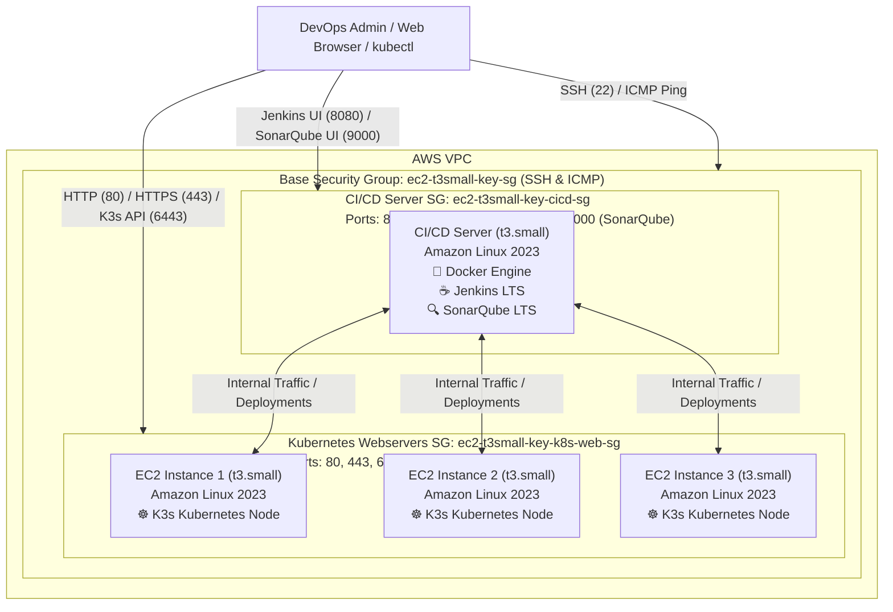

# Infrastructure as Code (IaC) Learning: AWS EC2, Ansible, K3s Kubernetes & CI/CD (Docker, Jenkins, SonarQube)

This project demonstrates an end-to-end Infrastructure as Code (IaC), configuration management, and DevOps workflow. It uses **Terraform** to provision AWS infrastructure (EC2 instances, modular security groups, and SSH keys), **Ansible** for automated node configuration and package management, and deploys **K3s (Lightweight Kubernetes)** on webservers alongside a containerized **CI/CD stack (Docker, Jenkins, and SonarQube)** on a dedicated CI/CD server.

---

## 🏗️ Architecture Overview



---

## 📁 Repository Structure

```text
.
├── Ansible/
│   ├── ansible.cfg                 # Ansible configuration (user, SSH key, inventory defaults)
│   ├── docker_jenkins_playbook.yml # Ansible playbook for Docker & Jenkins deployment on CI/CD server
│   ├── inventory.ini               # Inventory file defining [webservers] and [cicd] groups
│   └── playbook.yml                # Ansible playbook for system updates & K3s Kubernetes deployment
├── .gitignore                      # Git ignore file for secrets and state
├── main.tf                         # Terraform EC2 instances, key pair, and security groups
├── outputs.tf                      # Terraform output definitions (IDs, IPs, SSH commands, web URLs)
├── providers.tf                    # AWS and Local/TLS provider definitions
├── variables.tf                    # Configurable variables (region, instance type, CIDR)
├── terraform.tfvars                # Local variable values (credentials, region)
└── README.md                       # Project documentation
```

---

## ⚙️ What Was Built

### 1. Terraform Infrastructure
* **Automated SSH Key Management**:
  * An RSA 4096-bit private key is generated via `tls_private_key`.
  * The public key is registered in AWS as `aws_key_pair`.
  * The private key is saved locally to `ec2-key.pem` with secure permissions (`0600`) and ignored by git for security.
* **Security Group Configuration**:
  * **Base Management (`ec2_sg`)**:
    * **SSH (Port 22)**: Ingress allowed from the configured CIDR block.
    * **ICMP**: Ingress enabled across all types/codes (`0.0.0.0/0`) to allow pinging from anywhere.
    * **Intra-Cluster Intercommunication (`self = true`)**: Full traffic enabled between instances in the same security group over private IPs.
    * **Egress**: Unrestricted outbound access (`0.0.0.0/0`).
  * **Kubernetes Webservers (`k8s_web_sg`)**:
    * **HTTP (Port 80)** & **HTTPS (Port 443)**: Web application traffic.
    * **Kubernetes API (Port 6443)**: Remote cluster management via `kubectl`.
    * **NodePort Services (Ports 30000-32767)**: Exposed Kubernetes NodePort services.
  * **CI/CD Server (`cicd_sg`)**:
    * **Jenkins Web UI (Port 8080)**: Jenkins web interface.
    * **Jenkins Agent JNLP (Port 50000)**: Inbound Jenkins agent connections.
    * **SonarQube (Port 9000)**: SonarQube code quality dashboard & API.
* **Compute**:
  * Deploys 3 `t3.small` EC2 instances for Kubernetes webservers (`ec2_instance`, `second_ec2`, `third_ec2`).
  * Deploys 1 `t3.small` EC2 instance for the CI/CD server (`CI_CD_server_ec2`).

### 2. Ansible Integration
* **`inventory.ini`**:
  * Groups the 3 instance public IP addresses under `[webservers]`.
* **`ansible.cfg`**:
  * Automatically sets the default inventory to `./inventory.ini`.
  * Configures `remote_user = ec2-user`.
  * Specifies `private_key_file` pointing to the generated `ec2-key.pem`.
  * Disables strict host key checking (`host_key_checking = False`) for seamless automation.

### 3. K3s Lightweight Kubernetes
* **Automated Installation**:
  * Deploys single-node K3s instances on all target nodes via the official script (`https://get.k3s.io`).
  * Uses idempotent execution (`creates: /usr/local/bin/k3s`) to skip re-downloading if already present.
* **Systemd Service Management**:
  * Automatically enables and starts `k3s.service` using Ansible's `systemd` module.
* **Kubeconfig & Access**:
  * Waits for cluster initialization and kubeconfig creation (`/etc/rancher/k3s/k3s.yaml`).
  * Sets safe readable permissions (`0644`) on the kubeconfig.
* **Verification**:
  * Executes `k3s --version` and prints the output during playbook execution.

### 4. CI/CD Server Stack (Docker, Jenkins & SonarQube)
* **System & Virtual Memory Optimization**:
  * Automatically provisions and configures a **2GB swap file** (`/swapfile`) formatted and persisted in `/etc/fstab` to handle multiple container JVM workloads on `t3.small` smoothly.
  * Tunes kernel parameters required by SonarQube's embedded Elasticsearch:
    * `vm.max_map_count = 262144`
    * `fs.file-max = 65536`
* **Docker Engine**:
  * Installs the native Amazon Linux 2023 `docker` package.
  * Enables and starts `docker.service` with systemd.
  * Grants `ec2-user` access to the `docker` group.
* **Jenkins LTS**:
  * Deployed in a standalone container with restart policy `unless-stopped`.
  * Ports: `8080` (HTTP Web UI) and `50000` (JNLP inbound agents).
  * Data persistence backed by Docker named volume `jenkins_home`.
  * Reads initial admin password safely from `/var/jenkins_home/secrets/initialAdminPassword`.
* **SonarQube Community LTS**:
  * Deployed in a standalone container with restart policy `unless-stopped`.
  * Port: `9000` (Web UI & analysis API).
  * Memory limits tuned for JVM stability: `-e SONAR_SEARCH_JAVAADDITIONALOPTS="-Xms256m -Xmx512m"`.
  * Data persistence backed by Docker named volumes: `sonarqube_data`, `sonarqube_extensions`, and `sonarqube_logs`.

---

## 🚀 Quick Start Guide

### Prerequisites & Installation

#### 1. Install Terraform

<details>
<summary><b>Ubuntu / Debian</b></summary>

```bash
sudo apt-get update && sudo apt-get install -y gnupg software-properties-common curl
curl -fsSL https://apt.releases.hashicorp.com/gpg | sudo gpg --dearmor -o /usr/share/keyrings/hashicorp-archive-keyring.gpg
echo "deb [signed-by=/usr/share/keyrings/hashicorp-archive-keyring.gpg] https://apt.releases.hashicorp.com $(lsb_release -cs) main" | sudo tee /etc/apt/sources.list.d/hashicorp.list
sudo apt-get update && sudo apt-get install -y terraform
```
</details>

<details>
<summary><b>RHEL / CentOS / Amazon Linux / Fedora</b></summary>

```bash
sudo yum install -y yum-utils
sudo yum-config-manager --add-repo https://rpm.releases.hashicorp.com/RHEL/hashicorp.repo
sudo yum -y install terraform
```
</details>

<details>
<summary><b>macOS (Homebrew)</b></summary>

```bash
brew tap hashicorp/tap
brew install hashicorp/tap/terraform
```
</details>

<details>
<summary><b>Windows</b></summary>

```powershell
winget install HashiCorp.Terraform
# or using Chocolatey
choco install terraform
```
</details>

*Verify installation:*
```bash
terraform version
```

---

#### 2. Install Ansible

<details>
<summary><b>Using Python pipx / pip (Recommended for all platforms)</b></summary>

```bash
# Recommended with pipx (isolated environment)
sudo apt install -y pipx || sudo yum install -y pipx
pipx install --include-deps ansible
pipx ensurepath

# Or via standard pip
python3 -m pip install --user ansible
```
</details>

<details>
<summary><b>Ubuntu / Debian (via PPA)</b></summary>

```bash
sudo apt update
sudo apt install -y software-properties-common
sudo add-apt-repository --yes --update ppa:ansible/ansible
sudo apt install -y ansible
```
</details>

<details>
<summary><b>macOS (Homebrew)</b></summary>

```bash
brew install ansible
```
</details>

*Verify installation:*
```bash
ansible --version
```

---

### 1. Provision Infrastructure with Terraform

```bash
# Initialize Terraform and download providers
terraform init

# Validate the configuration
terraform validate

# Review the execution plan
terraform plan

# Deploy the infrastructure
terraform apply
```

After deployment completes, Terraform outputs the public IPs, private IPs, and ready-to-run SSH commands:

```bash
terraform output
```

---

### 2. Verify Connectivity

#### Direct SSH
Connect to any instance using the generated key:
```bash
ssh -i ./ec2-key.pem ec2-user@<INSTANCE_PUBLIC_IP>
```

#### ICMP Ping Between Instances
Log into one instance and ping another via its private IP:
```bash
ping <ANOTHER_INSTANCE_PRIVATE_IP>
```

---

### 3. Run Ansible

Move into the `Ansible/` directory to run commands using the configured `ansible.cfg` and `inventory.ini`:

```bash
cd Ansible
```

#### Connectivity & Verification
Test ping across all managed instances:
```bash
# Test connectivity to all webservers
ansible webservers -m ping
```

Expected output:
```text
13.63.20.236 | SUCCESS => {
    "ansible_facts": {
        "discovered_interpreter_python": "/usr/bin/python3.9"
    },
    "changed": false,
    "ping": "pong"
}
...
```

---

#### 💡 Essential Ansible Ad-Hoc CLI Commands

Ad-hoc commands allow quick one-liner actions across all target nodes without creating a dedicated playbook.

> [!TIP]
> Use `-b` (or `--become`) to execute commands with `sudo` privileges when making system-level changes (e.g. package installation, service controls).

##### 📦 Package Management (`dnf`)
```bash
# Refresh / update package repository cache
ansible webservers -b -m dnf -a "update_cache=yes"

# Upgrade all installed packages to their latest versions
ansible webservers -b -m dnf -a "name=* state=latest"

# Install a package (e.g., git or nginx)
ansible webservers -b -m dnf -a "name=git state=present"

# Remove an unwanted package
ansible webservers -b -m dnf -a "name=git state=absent"
```

##### 🖥️ System Health & Command Execution
```bash
# Check system uptime across instances (default module is command)
ansible webservers -a "uptime"

# Check available disk space
ansible webservers -a "df -h"

# Check memory usage
ansible webservers -a "free -m"

# Execute commands requiring pipes or shell redirection using the shell module
ansible webservers -m shell -a "uname -r && cat /etc/os-release | grep PRETTY_NAME"
```

##### ⚙️ Service Management (`service` / `systemd`)
```bash
# Start and enable a service on boot
ansible webservers -b -m service -a "name=nginx state=started enabled=yes"

# Restart a service
ansible webservers -b -m service -a "name=nginx state=restarted"

# Stop a service
ansible webservers -b -m service -a "name=nginx state=stopped"
```

##### 🔍 System Facts & Hardware Discovery (`setup`)
```bash
# Gather all system facts and environment variables
ansible webservers -m setup

# Filter for distribution information
ansible webservers -m setup -a "filter=ansible_distribution*"

# Filter for network IP information
ansible webservers -m setup -a "filter=ansible_default_ipv4"
```

##### 📁 Files & Directories (`file`, `copy`)
```bash
# Create a new directory
ansible webservers -m file -a "path=/home/ec2-user/app state=directory mode='0755'"

# Copy a local file to all remote servers
ansible webservers -m copy -a "src=./sample.txt dest=/home/ec2-user/sample.txt mode='0644'"

# Delete a file or directory
ansible webservers -m file -a "path=/home/ec2-user/sample.txt state=absent"
```

---

#### 🚀 Deploying K3s Kubernetes via Playbook

The [`Ansible/playbook.yml`](file:///home/anwartamasna/terraform_ec2_with_ssh_key/Ansible/playbook.yml) automates:
1. **System Upgrade**: Updates all OS packages via `dnf`.
2. **K3s Installation**: Fetches and executes the official K3s install script (`creates: /usr/local/bin/k3s`).
3. **Service Management**: Ensures `k3s.service` is enabled on boot and running via `systemd`.
4. **Cluster Readiness**: Waits for `/etc/rancher/k3s/k3s.yaml` to be created.
5. **Permissions**: Sets `0644` readable permissions on the kubeconfig.
6. **Verification**: Executes `k3s --version` and prints the output.

```bash
# 1. Validate playbook syntax
ansible-playbook --syntax-check playbook.yml

# 2. Deploy K3s across the entire webservers cluster
ansible-playbook playbook.yml
```

##### ☸️ Verifying K3s & Kubernetes Cluster with Ansible Ad-Hoc Commands

After deployment completes, verify cluster health and running workloads across all nodes directly:

```bash
# Check K3s service status
ansible webservers -a "systemctl status k3s"

# Check Kubernetes node status on each server
ansible webservers -a "k3s kubectl get nodes"

# Inspect running pods across all namespaces
ansible webservers -a "k3s kubectl get pods -A"

# Verify kubeconfig file exists and permissions are 0644
ansible webservers -a "ls -l /etc/rancher/k3s/k3s.yaml"
```

---

#### 🐳 Deploying Docker, Jenkins & SonarQube CI/CD via Playbook

The [`Ansible/docker_jenkins_playbook.yml`](file:///home/anwartamasna/terraform_ec2_with_ssh_key/Ansible/docker_jenkins_playbook.yml) automates the entire CI/CD stack:

1. **System & Swap Optimization**:
   - Creates and mounts a **2GB swap file** (`/swapfile`) with persistence in `/etc/fstab`.
   - Applies essential kernel parameters (`vm.max_map_count = 262144`, `fs.file-max = 65536`) for SonarQube's embedded Elasticsearch.
2. **Docker Engine**: Installs `docker` via `dnf`, enables/starts `docker.service`, and adds `ec2-user` to the `docker` group.
3. **Jenkins LTS**:
   - Pulls `jenkins/jenkins:lts`.
   - Runs container `jenkins` on ports `8080` (HTTP Web UI) and `50000` (JNLP inbound agents) with volume `jenkins_home:/var/jenkins_home` and `--restart unless-stopped`.
   - Waits for port `8080` readiness and retrieves the initial admin password from `/var/jenkins_home/secrets/initialAdminPassword`.
4. **SonarQube Community LTS**:
   - Pulls `sonarqube:lts-community`.
   - Runs container `sonarqube` on port `9000` (Web UI & analysis API) with JVM tuning and persistent volumes `sonarqube_data`, `sonarqube_extensions`, `sonarqube_logs`.
   - Waits for port `9000` to be available.
5. **Credentials & Access Summary**: Prints direct login URLs and default credentials.

```bash
# 1. Validate playbook syntax
ansible-playbook --syntax-check docker_jenkins_playbook.yml

# 2. Deploy Docker, Jenkins, and SonarQube targeting the CI/CD server
ansible-playbook docker_jenkins_playbook.yml --limit cicd
```

##### 🔑 Service Dashboard Access & Credentials

| Service | Port | Access URL | Default / Initial Credentials |
|---|---|---|---|
| **Jenkins** | `8080` | `http://<CICD_PUBLIC_IP>:8080` | Username: `admin`<br>Password: Displayed during playbook run (or via `docker exec`) |
| **Jenkins Agent** | `50000` | `<CICD_PUBLIC_IP>:50000` | JNLP listener for Jenkins build nodes |
| **SonarQube** | `9000` | `http://<CICD_PUBLIC_IP>:9000` | Username: `admin`<br>Password: `admin` *(prompted to update on first login)* |

##### 🔍 Verifying CI/CD Server Workloads & Containers

```bash
# Check all running Docker containers (use -b for sudo privileges)
ansible cicd -b -a "docker ps"

# View Jenkins initial admin password
ansible cicd -b -a "docker exec jenkins cat /var/jenkins_home/secrets/initialAdminPassword"

# Inspect Jenkins container logs
ansible cicd -b -a "docker logs --tail 30 jenkins"

# Inspect SonarQube container logs
ansible cicd -b -a "docker logs --tail 30 sonarqube"

# Restart containers if necessary
ansible cicd -b -a "docker restart jenkins"
ansible cicd -b -a "docker restart sonarqube"

# Check swap memory and RAM utilization
ansible cicd -b -a "free -h"
```

---

## 🧹 Cleanup / Teardown

To destroy all created AWS resources and prevent unwanted cloud charges:

```bash
terraform destroy
```